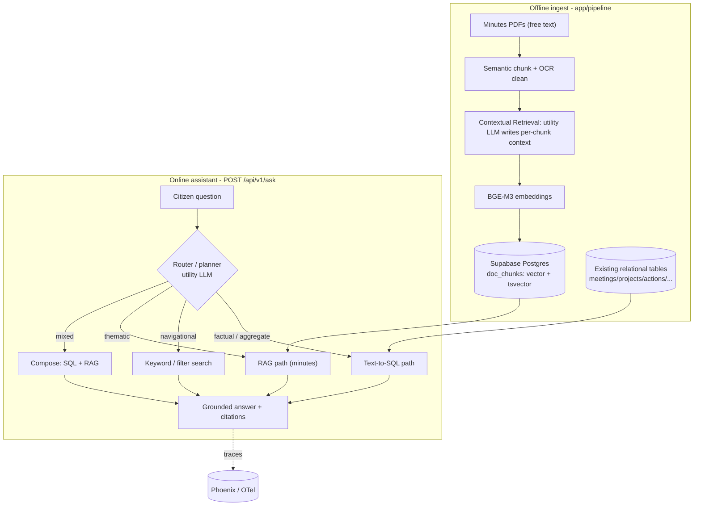
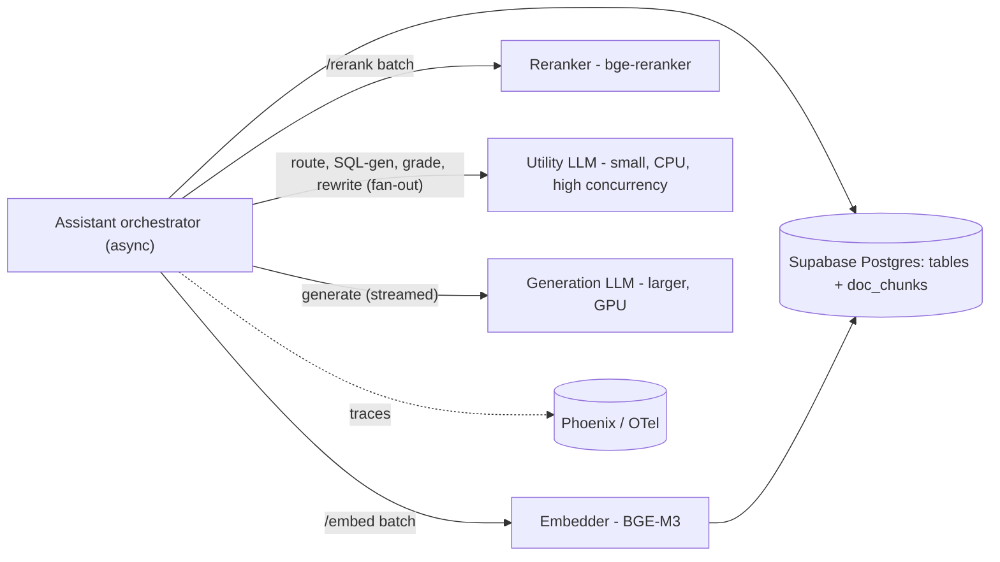

# Estero Public Meetings — Q&A Assistant (router-first: Text-to-SQL + RAG)

> Plan for a local-model, Postgres-native, **agentic** Q&A assistant for EagleGIS.
> Citizens ask natural-language questions about Village of Estero meetings and get
> grounded answers with citations back to the source records or minutes.
>
> Design goals: (1) **right tool per question** — deterministic SQL for facts,
> semantic RAG only for unstructured text; (2) fully local / free models; (3) keep
> everything inside the existing Supabase Postgres (reinforces the database-systems
> angle); (4) current (2026) best practices, portfolio / resume grade; (5) civic
> accuracy: never confidently fabricate a government fact — cite or abstain.

## Goal
Answer questions like "When did council vote on the BERT Rail Trail?", "How many
meetings discussed Corkscrew Road in 2025?", and "What concerns did residents
raise about septic-to-sewer?" — each answered by the *appropriate* engine, with a
citation to the row(s) or minutes page(s) it came from, and an honest "I don't
have that in the records" when evidence is missing.

## Why router-first (not RAG-only)
The meeting data is already **clean and relational** (projects, meeting_types,
meetings, documents, locations, actions). RAG is for *unstructured* text; running
it over already-structured data discards the structure and reintroduces
hallucination risk on exactly the factual questions a civic tool must get right.
So we route each question to the engine that answers it best:

| Question type | Engine | Why |
| --- | --- | --- |
| Factual lookup ("when did they vote on X?") | **Text-to-SQL** | Row lookup; deterministic; cites the exact record; can't hallucinate. |
| Aggregate / counting ("how many meetings in 2025?") | **Text-to-SQL** | RAG can't reliably count; SQL is exact. |
| Navigational ("show me Jan 2026 minutes") | **Keyword / filter search** | Cheap; reuses the existing MiniSearch / SQL filters. |
| Thematic / qualitative ("what concerns were raised about the river?") | **RAG over minutes PDFs** | Genuinely unstructured, spread across PDF prose — RAG's sweet spot. |
| Mixed ("what was decided *and* what did residents say about X?") | **Compose (SQL + RAG)** | SQL finds the decisions; RAG pulls the discussion; answer composed from both. |

RAG earns its place *only* because of the unstructured minutes PDFs. Everything
else is more accurate as SQL.

## Architecture

---

## The three answer paths

### 1. Text-to-SQL (the primary path)
For factual / aggregate / lookup questions over the existing schema.

**Approach — semantic layer first, guarded free-form fallback:**
- A curated **semantic layer** of ~10-15 vetted, parameterized query templates for
  the common intents (e.g. `meetings_by_project`, `meetings_in_year`,
  `votes_on_project`, `next_meeting`, `count_meetings_about`,
  `actions_by_meeting`). The utility LLM maps the question to `(intent, params)`
  with structured output; we run the *vetted* SQL. This covers most traffic with
  zero injection risk.
- **Free-form text-to-SQL** as the long-tail fallback: the utility LLM is given a
  compact schema description + few-shot NL->SQL examples and emits a single SELECT.

**SQL safety guard (non-negotiable):**
- Execute as a dedicated **read-only** Postgres role (or read-only Supabase RPCs) —
  never the write-capable service key.
- Validate every generated statement with `sqlglot`: exactly one statement, `SELECT`
  only (reject any DDL/DML), only allowlisted tables/columns, inject a mandatory
  `LIMIT`, and set a per-statement timeout.
- On validation failure -> abstain (don't execute).

**Answering:** the generation LLM turns the returned rows into a sentence and
**cites the rows** (meeting date, project, minutes URL). If zero rows -> "I don't
have that in the records."

### 2. RAG over minutes PDFs (the unstructured path)
Only the genuinely free-text minutes go through RAG.

- **Corpus:** minutes PDF text via `extract_text_from_pdf_bytes`
  (`app/pipeline/validate/pdf_location.py`) + `resolve_minutes_url`
  (`app/pipeline/collect/minutes.py`), plus the free-text `ActionTaken` / `RawText`
  fields from the gold CSVs. Skip future-dated (unconcluded) meetings.
- **Chunking:** semantic / boundary-aware (~500-800 tokens, ~100 overlap), reusing
  OCR cleanup from `app/pipeline/clean/text.py`. Metadata per chunk: `meeting_id,
  source, project_name, meeting_type, meeting_date, minutes_url, chunk_index`.
- **Contextual Retrieval** (Anthropic): prepend a short utility-LLM-written context
  line to each chunk before embedding (~35% fewer retrieval misses). Embed with
  context; show/cite the original content.
- **Storage:** one `doc_chunks` table with both a `vector(1024)` (HNSW, cosine) and
  a generated `tsvector` (GIN) column. Idempotent `content_hash` upsert, batched
  per `app/pipeline/publish/supabase.py` conventions.
- **Retrieval:** `hybrid_search(query_embedding, query_text, match_count)` SQL
  function runs dense (pgvector) + lexical (tsvector) rankings, over-fetches ~50
  per side, and fuses with **Reciprocal Rank Fusion** (`1/(60+rank)`). Then a
  **cross-encoder rerank** (`bge-reranker-v2-m3`) keeps the top ~5.
- **Cited generation + abstention:** grounded prompt, structured JSON output
  (`answer`, `citations[]`, `confidence`); short-circuit to abstention when max
  rerank score is below threshold.

### 3. Keyword / faceted search (the navigational path)
For "show me / find" requests: reuse the existing MiniSearch (frontend) and SQL
filters — no LLM, instant, zero hallucination. The router sends simple
navigational intents here.

---

## Router / planner
A single small structured **utility-LLM** call classifies each question into
`factual_sql | aggregate_sql | navigational | thematic_rag | mixed | out_of_scope`
and extracts parameters. For `mixed`, the planner emits a small plan (SQL sub-query
+ RAG sub-query) run **concurrently** and composed by the generation LLM.
`out_of_scope` questions get a polite "I can only answer about Estero public
meetings." Knowing when **not** to invoke an LLM/RAG is the core design decision.

---

## Tier 1 — Corrective RAG (CRAG) on the thematic path
Insert a lightweight **retrieval grader** between retrieval and generation on the
RAG path: a structured utility-LLM call scores the reranked context as
`Correct | Ambiguous | Incorrect`.
- Correct -> generate.
- Ambiguous/Incorrect -> **rewrite the query** and re-run hybrid search.
- Hard cap at 2-3 iterations; otherwise abstain.

This is the dominant 2025-26 production pattern. Implement as a small explicit
state machine (hand-rolled to keep deps light, or LangGraph if you want the named
framework on the resume).

---

## Models (local, free) — role-tiered
Work is split across **specialized models**, each its own service. Small jobs get a
small fast model; only final generation needs the big one.

| Role | Model | Service / hardware | Notes |
| --- | --- | --- | --- |
| Embeddings | **BAAI/bge-m3** (MIT, ~568M) | `embedder` — CPU/GPU | dense+sparse+multi-vector in one model; 1024-dim, 8k ctx. Light alt: nomic-embed-text-v2 / EmbeddingGemma-300M. |
| Reranker | **BAAI/bge-reranker-v2-m3** | `reranker` — CPU/GPU | reorders fused candidates. |
| **Utility LLM** (router, **SQL generation**, CRAG grader, query rewrite, HyDE, ingest contextualizer) | small: `qwen3:1.7b` / `llama3.2:1b` | `llm-utility` — CPU, scale-out, high concurrency | many cheap structured calls fired **concurrently**. |
| **Generation LLM** (final cited answer / row narration) | larger: `qwen3:4b`/`8b`, `llama3.3` | `llm-generation` — GPU, low concurrency | runs once per query, streamed. |

Graceful degradation: generation down -> return SQL rows / reranked snippets +
citations (no prose); utility down -> fall back to keyword search + direct row
lookups (skip routing/SQL-gen/grading).

---

## Multi-LLM service decomposition & concurrency
Splitting the model layer into independent services lets each scale and fail on its
own, and lets independent steps run concurrently.

Where the concurrency is (async orchestrator, `asyncio.gather` + per-service
semaphores):
- **Query phase:** route classification ∥ (for RAG) multi-query expansion ∥ HyDE.
- **Mixed questions:** the SQL sub-query and the RAG sub-query run **concurrently**.
- **Retrieval:** dense (pgvector) ∥ lexical (tsvector), then RRF-fuse.
- **CRAG grading:** grade the top-k docs **in parallel** (N concurrent utility-LLM
  calls) — the biggest latency win in the agentic loop.
- **Ingest contextualization:** fan thousands of chunks out across the horizontally
  scaled utility service with a bounded worker pool.

The deployed `rag_service/` already supports this: `/generate` is async and
`role`-aware (`utility` | `generation`, via `UTILITY_OLLAMA_URL` /
`GENERATION_OLLAMA_URL`), and `/generate_batch` fans out concurrently under a
semaphore — the exact primitive used for SQL-gen, CRAG grading, and contextualizer
fan-out. See `docs/DEPLOY_CLOUD_RUN.md`.

---

## Storage (Supabase Postgres — one database for both paths)
- **SQL path:** the existing normalized tables, unchanged. Add a **read-only role**
  (or read-only RPCs) for the assistant.
- **RAG path:** new `db/migrations/0001_doc_chunks.sql`:
  `public.doc_chunks(id bigint pk, meeting_id int, source text, project_name text,
  meeting_type text, meeting_date date, minutes_url text, chunk_index int,
  content text, context text, embedding vector(1024),
  fts tsvector generated always as (to_tsvector('english', content)) stored,
  content_hash text unique)` + HNSW (embedding) + GIN (fts) indexes + the
  `hybrid_search` RRF function.

---

## Guardrails
- **SQL safety:** read-only role; `sqlglot` validation (single SELECT, allowlisted
  tables/columns, forced LIMIT, statement timeout); abstain on validation failure.
- **Grounding:** SQL answers cite rows; RAG answers cite minutes pages; abstain on
  empty results / low confidence. Never fabricate a civic fact.
- **Scope:** exclude future-dated/unconcluded meetings; prefer `link_status=uploaded`
  PDFs; `out_of_scope` questions politely declined.
- **Bounded agentics:** CRAG loop capped (2-3 iters); per-service timeouts; optional
  semantic cache.

---

## Evaluation
- **Router accuracy:** labeled question set -> correct path classification rate.
- **Text-to-SQL:** *execution accuracy* (does the generated/selected SQL return the
  expected rows?) on a golden NL->SQL set (Spider-style), plus guard-rejection rate.
- **RAG path (RAGAS):** faithfulness, answer relevancy, context precision/recall on a
  golden Q&A set with expected source meetings.
- Wire threshold gates into CI (`.github/workflows/`) so quality can't silently
  regress.

## Observability
OpenTelemetry spans -> **Arize Phoenix** (local, open-source): per-question route
decision, generated SQL, retrieved chunks, rerank/grader verdicts, tokens.

---

## Tier 2 — Stretch (distinctive, optional)
- **GraphRAG-lite:** your relational schema already *is* a graph
  (projects<->meetings<->locations<->actions); SQL joins give multi-hop for free.
  Build entity/relationship context only if you need narrative multi-hop answers.
- **pgvectorscale / StreamingDiskANN:** documented scale path (HNSW -> DiskANN +
  Statistical Binary Quantization + label-filtered search) — not needed at this
  corpus size; showing the reasoning is the point.

---

## New code (proposed `app/assistant/` package)
Supersedes the earlier RAG-only `app/rag/` naming, since the assistant is broader
than RAG.

- `app/assistant/config.py` — model names, top-k, RRF k, rerank/grader thresholds,
  CRAG max iterations, SQL allowlist + LIMIT (env-overridable, mirrors `app/config.py`).
- `app/assistant/router.py` — question classification + parameter extraction (+ plan
  for `mixed`).
- `app/assistant/sql/semantic_layer.py` — vetted parameterized query templates per
  intent.
- `app/assistant/sql/text_to_sql.py` — free-form NL->SQL fallback.
- `app/assistant/sql/guard.py` — `sqlglot` validation + read-only execution.
- `app/assistant/rag/chunk.py`, `contextualize.py`, `ingest.py`, `retrieve.py`,
  `grade.py` — the RAG path (semantic chunking, Contextual Retrieval, idempotent
  upsert, hybrid_search + rerank, CRAG grader/rewrite).
- `app/assistant/keyword.py` — navigational search (SQL filters / MiniSearch bridge).
- `app/assistant/generate.py` — async, role-aware Ollama client; grounded prompts +
  structured cited output; bounded-concurrency batch helper.
- `app/assistant/answer.py` — async orchestrator: route -> dispatch (SQL | RAG |
  keyword | compose) -> generate, with concurrent fan-out and OTel spans.
- `app/assistant/eval.py` + `tests/assistant_eval/` — router/SQL/RAGAS harness + golden sets.
- `app/routers/ask.py` — `POST /api/v1/ask` ({question} -> {answer, path, citations[],
  sql?, chunks?, trace_id}); register in `app/main.py`.
- `app/models/schemas.py` — `AskRequest` / `AskResponse` / `Citation`.
- `db/migrations/0001_doc_chunks.sql` — RAG table + indexes + `hybrid_search`; and a
  read-only DB role for the SQL path.

### Pipeline / CLI integration
Add a `--build-rag-index` flag to `app/pipeline/run.py` (matching
`--verify-pdf-locations`) that calls `app.assistant.rag.ingest.build_index()` after
gold and records a section in the run manifest. Keeps indexing off the default path.

### Frontend
"Ask about Estero meetings" chat box in `app/static/dashboard.html` -> `POST
/api/v1/ask`; render the answer plus citations (row links / `MinutesURL`), and show
which path answered (transparency).

---

## Dependencies (add to `requirements.txt`)
- `sentence-transformers` or `FlagEmbedding` (BGE-M3 + bge-reranker; pulls torch).
- `sqlglot` (SQL parsing/validation for the text-to-SQL guard).
- `httpx` (async calls to the model services).
- `ragas` + `datasets` (eval; dev/CI).
- `arize-phoenix` + `openinference-instrumentation` + `opentelemetry-sdk` (tracing; optional/dev).
- `langgraph` (only if you choose the framework route for the agentic loop).
- `pypdf` already present. Ollama is an external local service. No cloud API cost.

## Deployment
Already built — see `docs/DEPLOY_CLOUD_RUN.md`: the role-tiered model services
(`embedder`/`reranker` in `rag_service`, plus `llm-utility` (CPU) and
`llm-generation` (GPU) Ollama services) on Cloud Run, with all three CI/CD paths
(GitHub Actions WIF, Cloud Build, manual `gcloud`). SQL generation is just another
`role=utility` job; SQL **execution** runs in the app against Supabase.

## How to describe this on a resume
- "Built an **agentic civic Q&A assistant** that routes each question to the right
  engine — **text-to-SQL** (with a vetted semantic layer + `sqlglot` safety guard,
  read-only role) for factual/aggregate questions and **hybrid RAG** (pgvector +
  Postgres full-text, RRF, cross-encoder rerank, Corrective-RAG) for unstructured
  minutes — eliminating hallucination on government facts."
- "Decomposed the model layer into independently-scaled microservices (embedder,
  reranker, a small high-concurrency utility LLM, a GPU generation LLM) on Cloud
  Run, with an async orchestrator that fans out routing, SQL-gen, and per-document
  grading concurrently; added router-accuracy, SQL execution-accuracy, and RAGAS eval
  gates with OpenTelemetry/Phoenix tracing in CI."

## Out of scope (initial)
- Cloud-hosted LLM APIs, multi-turn memory, fine-tuned/Self-RAG models, write access
  of any kind, incremental PDF re-embedding beyond `content_hash` upsert.

## Implementation checklist
- [ ] **schema-roles** — `db/migrations/0001_doc_chunks.sql` (vector+tsvector+HNSW+GIN+`hybrid_search`); add a read-only DB role/RPCs for the SQL path
- [ ] **router** — `app/assistant/router.py`: classify + extract params + plan for `mixed`
- [ ] **text-to-sql** — semantic-layer templates + free-form fallback + `sqlglot` guard + read-only execution + row-cited answers
- [ ] **rag-path** — chunk, Contextual Retrieval, ingest (idempotent), hybrid retrieve + RRF + rerank, CRAG grader/rewrite
- [ ] **keyword** — navigational SQL-filter / MiniSearch path
- [ ] **orchestrator-api** — async `answer.py` (concurrent dispatch + compose), `generate.py`, `AskRequest/AskResponse/Citation`, `app/routers/ask.py`
- [ ] **multi-llm-deploy** — `llm-utility` (CPU, scale-out) + `llm-generation` (GPU) Cloud Run services wired via `UTILITY_OLLAMA_URL` / `GENERATION_OLLAMA_URL` (done in rag_service/deploy)
- [ ] **eval-obs** — router accuracy + SQL execution accuracy + RAGAS gates in CI; OTel/Phoenix tracing
- [ ] **pipeline-hook** — `--build-rag-index` flag in `app/pipeline/run.py`
- [ ] **frontend** — chat box in `app/static/dashboard.html` showing answer, citations, and which path answered
- [ ] **stretch** — GraphRAG-lite; pgvectorscale/StreamingDiskANN scale path
